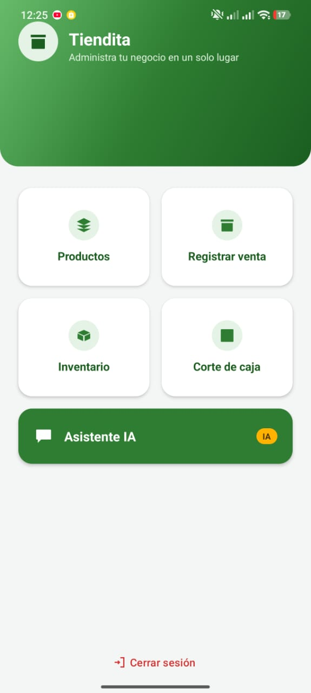

# Tiendita

Sistema de punto de venta e inventario para pequeños negocios, disponible
como **app Android nativa** y como **panel web**, ambos conectados en
tiempo real a la misma base de datos en **Cloud Firestore**. Incluye un
**asistente de inteligencia artificial** (Google Gemini con respaldo
automático de Groq) que responde preguntas sobre el negocio usando datos
reales.

Este repositorio reúne los tres entregables del proyecto:

| Carpeta | Contenido |
|---|---|
| [`app/`](app) | App Android nativa (Kotlin + Firebase) |
| [`web/`](web) | Panel web (HTML/CSS/JavaScript + Firebase) |
| [`docs/`](docs) | Documentación técnica completa (SRS, historias de usuario, diagramas, pruebas) |

## Capturas

| App Android — Dashboard | Panel Web — Productos |
|---|---|
|  |  |

## Arquitectura

Tiendita no tiene un servidor propio: usa **Firebase** como *Backend as a
Service* (Authentication + Cloud Firestore). Tanto la app Android como el
panel web leen y escriben directamente sobre las mismas colecciones
(`productos`, `ventas`, `cortes`, `usuarios`), sincronizadas en tiempo real
mediante *listeners* (`onSnapshot` / `addSnapshotListener`).

```
                     ┌─────────────────────┐
   App Android  ───▶ │                     │
   (Kotlin)          │   Cloud Firestore   │ ◀─── Panel Web
                      │   + Authentication  │      (HTML/JS)
   Panel Web    ───▶  │      (Firebase)     │
   (HTML/JS)          │                     │
                       └─────────┬───────────┘
                                 │
                     Asistente IA (Gemini → Groq)
```

## Funcionalidades principales

- Autenticación con roles (`vendedor` / `cliente`).
- Gestión de productos (alta, edición, baja).
- Registro de ventas con carrito y descuento automático de inventario.
- Alertas de stock bajo.
- Corte de caja con historial y comprobante en PDF.
- Tienda de autoservicio para clientes, con tiquet de compra en PDF.
- Asistente de IA con contexto real del negocio y respaldo automático entre
  proveedores.
- Sincronización en tiempo real entre la app y el panel web.

## Empezar

- Para correr la **app Android**, ve a [`app/README.md`](app/README.md).
- Para correr el **panel web**, ve a [`web/README.md`](web/README.md).
- Para leer la **documentación técnica** (requerimientos, historias de
  usuario, diagramas, pruebas), ve a [`docs/`](docs).

## Autor

**Benjamín Alberto Arce Hernández** — Ingeniería en Tecnologías de la
Información, Universidad Politécnica Metropolitana de Hidalgo.
