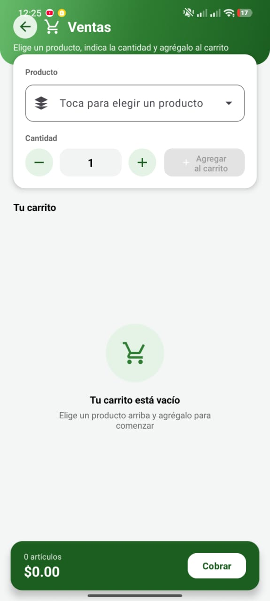
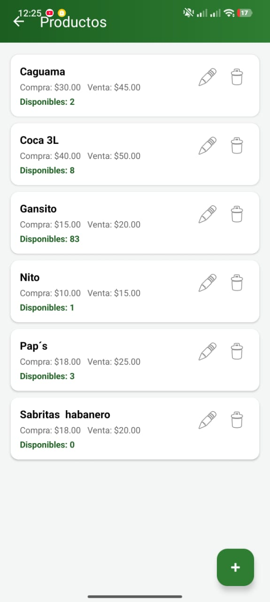
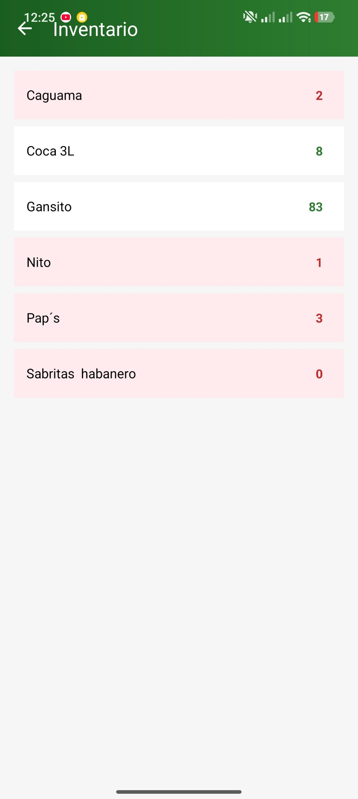
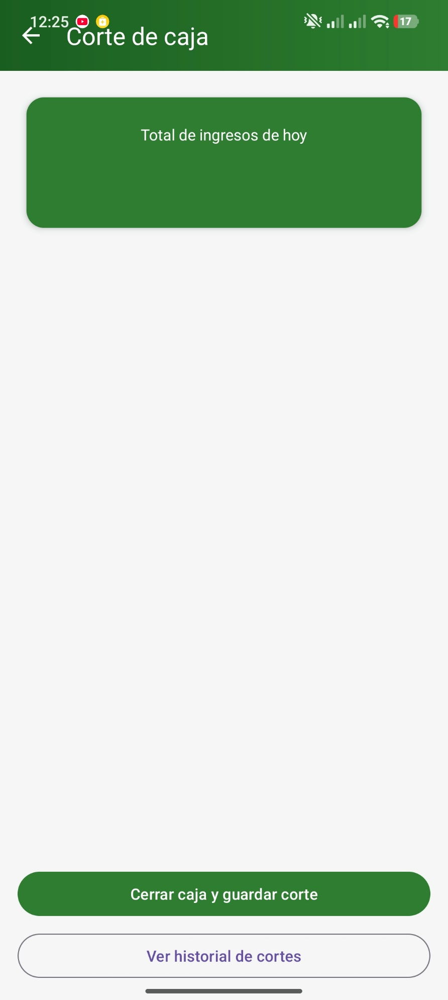
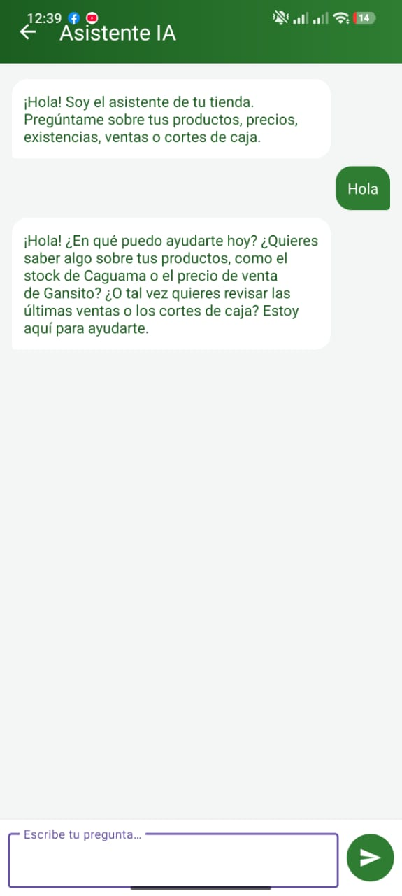
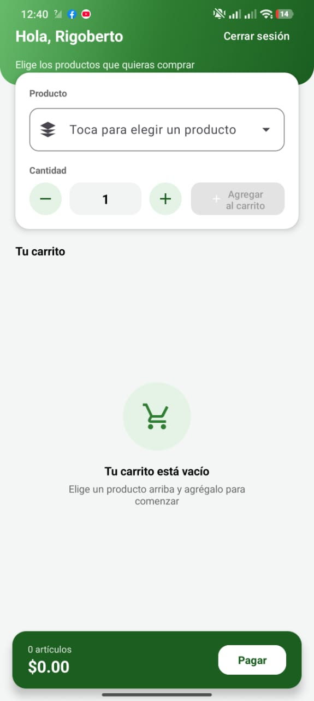

# Tiendita — App Android

App nativa en **Kotlin** para gestionar un punto de venta e inventario de un
pequeño negocio: productos, ventas, corte de caja y un **asistente de
inteligencia artificial** con contexto real del negocio.

Comparte la misma base de datos en tiempo real (**Cloud Firestore**) que el
[panel web de Tiendita](../web), de modo que cualquier cambio hecho desde el
celular se refleja de inmediato en la computadora, y viceversa.

> Este proyecto vive dentro del repositorio monorepo de Tiendita, junto con
> el [panel web](../web) y la [documentación técnica](../docs).

## Capturas

| Panel del vendedor | Registrar venta | Productos |
|---|---|---|
|  |  |  |

| Inventario | Corte de caja | Asistente IA | Tienda del cliente |
|---|---|---|---|
|  |  |  |  |

## Funcionalidades

- **Autenticación con roles** (`vendedor` / `cliente`) mediante Firebase
  Authentication, con redirección automática al panel correspondiente.
- **Gestión de productos**: alta, edición y baja, con precio de compra,
  precio de venta y cantidad disponible.
- **Ventas con carrito**: selección de varios productos y cantidades antes
  de cobrar, con descuento automático de inventario.
- **Alertas de stock bajo**: notificación local cuando un producto llega a
  5 unidades o menos.
- **Corte de caja**: cierre de turno con historial y generación de un
  comprobante en **PDF**.
- **Tienda de autoservicio**: los clientes pueden registrarse, comprar
  directamente del catálogo y descargar su tiquet en PDF.
- **Asistente de IA**: responde preguntas en lenguaje natural sobre
  productos, ventas y cortes, usando datos reales leídos de Firestore.
  Usa **Google Gemini** como proveedor principal y **Groq** como respaldo
  automático si el primero falla.
- **Sincronización en tiempo real** con el panel web mediante listeners de
  Firestore (`addSnapshotListener`).

## Stack técnico

| Componente | Tecnología |
|---|---|
| Lenguaje | Kotlin |
| UI | Material Components 3, ConstraintLayout, ViewBinding |
| Backend | Firebase Authentication + Cloud Firestore |
| Notificaciones | NotificationManager (Android) |
| IA | Google Gemini API (`gemini-2.0-flash`) + Groq API (`llama-3.3-70b-versatile`) |
| Networking | OkHttp |
| Concurrencia | Kotlin Coroutines |
| Compatibilidad | Android 7.0 (API 24) en adelante |

## Estructura del proyecto

```
app/src/main/java/com/example/tiendita/
├── model/         # Producto, Venta, CorteCaja, Usuario, ItemCarrito
├── util/          # Constants, MoneyUtil, NotificationHelper, PdfUtil
├── productos/      Gestión de catálogo
├── ventas/         Registro de ventas con carrito
├── inventario/     Consulta de existencias
├── caja/           Corte de caja + historial + PDF
├── cliente/         Registro y tienda de autoservicio del cliente
├── carrito/         Lógica de carrito de compra
└── chatbot/
    └── ai/          AiProvider, GeminiProvider, GroqProvider, ChatRepository
```

## Cómo ejecutar el proyecto

### 1. Requisitos

- Android Studio (Ladybug o más reciente).
- JDK 17.
- Una cuenta de Firebase.

### 2. Configurar Firebase

1. Crea un proyecto en la [consola de Firebase](https://console.firebase.google.com/)
   (o usa uno existente) y registra una app Android con el paquete
   `com.example.tiendita`.
2. Descarga el archivo `google-services.json` que te da Firebase y colócalo
   en `app/google-services.json` (usa `app/google-services.json.example`
   como referencia del formato esperado; ese archivo **no** se sube al
   repositorio porque contiene datos propios de cada proyecto).
3. En la consola, habilita **Authentication → Correo/contraseña** y
   **Firestore Database**, y configura las reglas de seguridad:

   ```
   rules_version = '2';
   service cloud.firestore {
     match /databases/{database}/documents {
       match /{document=**} {
         allow read, write: if request.auth != null;
       }
     }
   }
   ```

   Más detalle en [`CONECTAR_FIREBASE.md`](CONECTAR_FIREBASE.md).

### 3. Configurar el Asistente de IA (opcional)

Copia tus claves de [Google AI Studio](https://aistudio.google.com/) y de
[Groq](https://console.groq.com/) al archivo `local.properties` (que
tampoco se sube al repositorio):

```properties
GEMINI_API_KEY=tu_api_key_de_gemini
GROQ_API_KEY=tu_api_key_de_groq
```

Más detalle en [`CONECTAR_CHATBOT.md`](CONECTAR_CHATBOT.md).

### 4. Compilar y ejecutar

Abre el proyecto en Android Studio y ejecútalo en un emulador o dispositivo
físico con Android 7.0 o superior.

## Proyecto relacionado

- 🌐 [Panel web de Tiendita](../web) — misma base de datos, para administrar
  el negocio desde una computadora.
- 📄 [Documentación técnica completa](../docs) — SRS, historias de usuario,
  diagramas y pruebas.

## Autor

**Benjamín Alberto Arce Hernández** — Ingeniería en Tecnologías de la
Información, Universidad Politécnica Metropolitana de Hidalgo.
