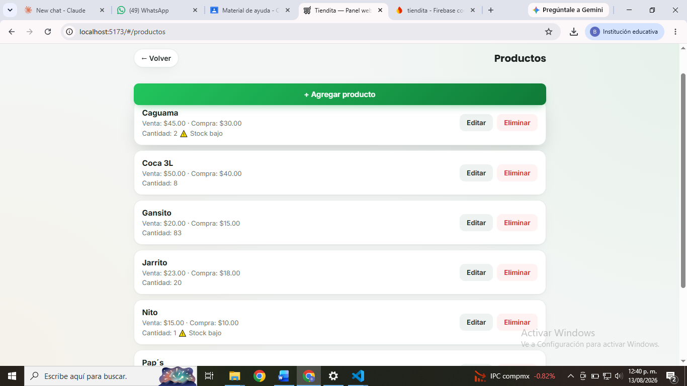
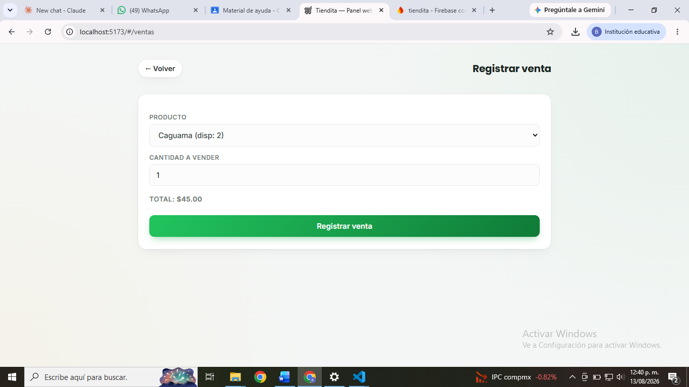
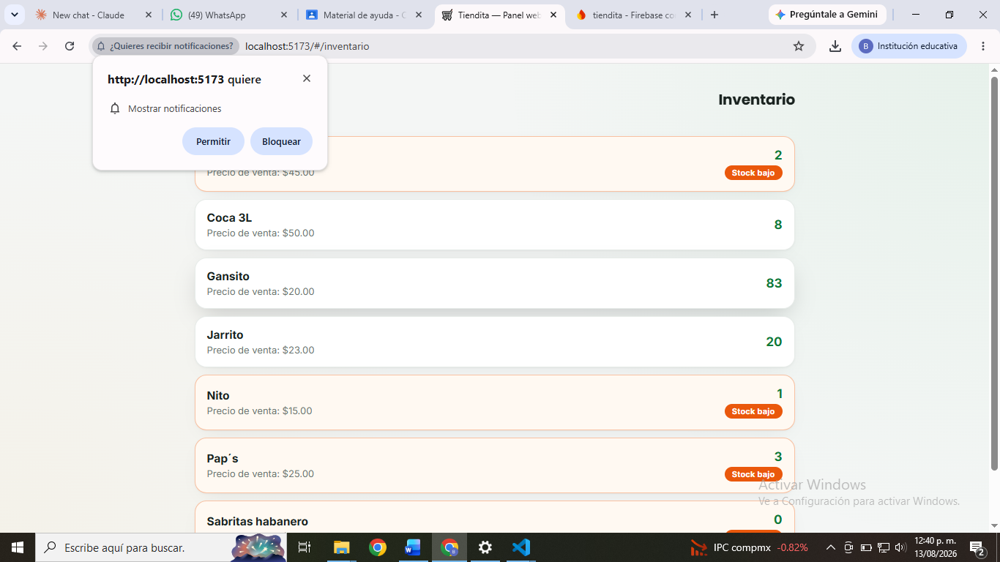
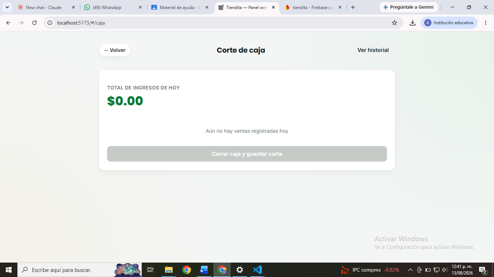
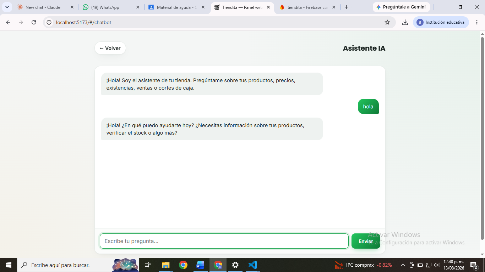

# Tiendita — Panel Web

Panel web para gestionar un punto de venta e inventario de un pequeño
negocio: productos, ventas, corte de caja, una tienda de autoservicio para
clientes y un **asistente de inteligencia artificial** con contexto real del
negocio.

Construido con **HTML, CSS y JavaScript puro** (sin frameworks) y conectado
a **Cloud Firestore**, comparte en tiempo real la misma base de datos que la
[app Android de Tiendita](../app): lo que se registra desde el celular se ve
al instante en la computadora, y viceversa.

> Este proyecto vive dentro del repositorio monorepo de Tiendita, junto con
> la [app Android](../app) y la [documentación técnica](../docs).

## Capturas

| Productos | Registrar venta |
|---|---|
|  |  |

| Inventario | Corte de caja | Asistente IA |
|---|---|---|
|  |  |  |

## Funcionalidades

- **Autenticación con roles** (`vendedor` / `cliente`) mediante Firebase
  Authentication, con redirección automática al panel correspondiente.
- **Gestión de productos**: alta, edición y baja, con precio de compra,
  precio de venta y cantidad disponible.
- **Registro de ventas**: selección de producto y cantidad, con cálculo
  automático del total y descuento de inventario.
- **Inventario**: vista dedicada con alerta visual de stock bajo (5
  unidades o menos).
- **Corte de caja**: cierre de turno con historial y generación de un
  comprobante en **PDF**, descargado automáticamente por el navegador.
- **Tienda de autoservicio**: los clientes pueden registrarse, comprar
  directamente del catálogo y descargar su tiquet en PDF.
- **Asistente de IA**: responde preguntas en lenguaje natural sobre
  productos, ventas y cortes, usando datos reales leídos de Firestore. Usa
  **Google Gemini** como proveedor principal y **Groq** como respaldo
  automático si el primero falla.
- **Sincronización en tiempo real** con la app Android mediante listeners
  (`onSnapshot`) sobre las mismas colecciones de Firestore.

## Arquitectura

No hay un backend propio: la persistencia de datos ocurre directamente
desde el navegador hacia **Cloud Firestore** (protegida por reglas de
seguridad que exigen sesión iniciada), usando el **Firebase JS SDK
(modular, vía CDN)**. Es el mismo proyecto de Firebase que usa la app
Android (`tiendita-6771c`), por lo que ambos clientes leen y escriben las
mismas colecciones (`productos`, `ventas`, `cortes`, `usuarios`).

## Requisitos

- [Node.js](https://nodejs.org) (LTS) — solo para levantar el servidor
  estático local (`serve`); la app no usa ningún framework ni build step.
- Un proyecto de Firebase con **Authentication** (correo/contraseña) y
  **Cloud Firestore** habilitados.

## Puesta en marcha

Instrucciones detalladas, paso a paso (incluye cómo registrar la app Web en
Firebase y dónde conseguir las claves de IA), en **[LEEME.md](LEEME.md)**.

Resumen rápido:

```bash
# 1. Copia el archivo de configuración de ejemplo y pon tus claves reales
cp js/config.example.js js/config.js
# edita js/config.js con tu firebaseConfig y tus API keys de Gemini/Groq

# 2. Instala dependencias y levanta el servidor local
npm install
npm start
```

Abre `http://localhost:5173` en tu navegador e inicia sesión con el mismo
usuario que ya usas en la app Android.

> `js/config.js` contiene tus claves reales y **no se sube a git** (ver
> `.gitignore`). El repositorio solo incluye `js/config.example.js` como
> plantilla.

## Estructura del proyecto

```
tiendita-web/
├── index.html
├── css/
│   └── style.css
└── js/
    ├── firebase.js          # Conexión a Firebase (Auth + Firestore)
    ├── config.example.js    # Plantilla de configuración (copiar a config.js)
    ├── main.js               # Enrutador de la SPA (hash routing)
    ├── pages/                 # Cada pantalla: login, registro, dashboard,
    │                          # productos, ventas, inventario, caja,
    │                          # historial, chatbot, tienda (cliente)
    └── utils/
        ├── chatRepository.js  # Lógica del asistente IA (Gemini + Groq)
        ├── pdf.js              # Generación de PDF (corte y tiquet)
        ├── money.js            # Formato de moneda (MXN)
        ├── session.js          # Estado del rol de sesión
        ├── notificaciones.js   # Alertas de stock bajo
        └── constants.js        # Nombres de colecciones de Firestore
```

## Proyecto relacionado

- [`app/`](../app) — App Android (Kotlin) que comparte esta misma base de
  datos.
- [`docs/`](../docs) — Documentación técnica completa del sistema (SRS bajo
  IEEE 830-1998, historias de usuario, diagramas de base de datos y de
  clases, pruebas, etc.).
